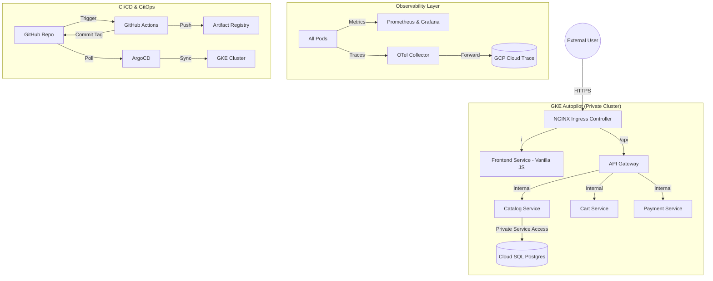

# 🛒 Production E-Commerce Platform on GKE Autopilot
### End-to-End GitOps · Zero-Trust Security · Full-Stack Observability · Disaster Recovery

---

## 🏗️ Architecture Overview



---

## 🚀 Technical Highlights

### 🎨 Premium Frontend & Split-Routing
*   **Vanilla JS Web App**: High-performance, zero-framework frontend with a modern glassmorphism design.
*   **Split-Routing Ingress**: Implemented regex-based routing at the NGINX layer to direct `/api` traffic to the Gateway and all other traffic to the Frontend.
*   **Security**: Runs as a **non-root user** on port 8080 to comply with GKE Autopilot security standards.

### 🛡️ Zero-Trust Security & Hardening
*   **Identity**: Implemented **Workload Identity** for keyless, secure access to GCP services.
*   **Network**: Enforced **default-deny-all** NetworkPolicies for microservice isolation.
*   **Registry**: Automated vulnerability scanning via Google Artifact Registry.

### 📊 Full-Stack Observability (Hardened for Autopilot)
*   **Prometheus/Grafana**: Tailored Helm configuration that bypasses Autopilot's restricted host access.
*   **Distributed Tracing**: End-to-end request tracing via OpenTelemetry and **GCP Cloud Trace**.
*   **Dashboards**: Custom 10-panel "Ecommerce Overview" dashboard for SRE visibility.

### 🌪️ Disaster Recovery & Automation
*   **One-Command Rebuild**: Featuring `scripts/nuke-and-rebuild.sh` which can provision the VPC, GKE, Cloud SQL, and bootstrap the entire platform from scratch in under 15 minutes.
*   **State Management**: Multi-cloud Terraform state with S3 (AWS) and GCS (GCP) backends.

---

## 📁 Technical Deep-Dives (Documentation Map)

| Document | Purpose |
| :--- | :--- |
| **[Interview Questions](file:///c:/Users/ajith/Downloads/interview%20qas/ecommerce-gcp-project%20(1)/ecommerce-gcp-project/docs/interview-prep/interview-questions.md)** | 20+ architectural Q&As based on this project. |
| **[SRE Metrics Guide](file:///c:/Users/ajith/Downloads/interview%20qas/ecommerce-gcp-project%20(1)/ecommerce-gcp-project/docs/interview-prep/sre-metrics-guide.md)** | Deep dive into the Four Golden Signals. |
| **[Observability Hardening](file:///c:/Users/ajith/Downloads/interview%20qas/ecommerce-gcp-project%20(1)/ecommerce-gcp-project/docs/OBSERVABILITY-HARDENING.md)** | Lessons learned implementing monitoring on Autopilot. |
| **[GitOps Troubleshooting](file:///c:/Users/ajith/Downloads/interview%20qas/ecommerce-gcp-project%20(1)/ecommerce-gcp-project/docs/GITOPS-TROUBLESHOOTING.md)** | Post-mortem of race conditions and auth fixes. |
| **[Deployment Guide](file:///c:/Users/ajith/Downloads/interview%20qas/ecommerce-gcp-project%20(1)/ecommerce-gcp-project/docs/deployment/deployment-guide.md)** | Zero-to-Live command reference. |

---

## 🛠️ Step-by-Step Setup

### 1. Prerequisite Checklist
```bash
gcloud CLI, Terraform, kubectl, helm, argocd CLI
```

### 2. Rapid Provisioning
```bash
# 1. Set your Project ID
export PROJECT_ID="my-project-32062-newsletter"

# 2. Run the Nuke & Rebuild automation (Pro-Level)
chmod +x scripts/nuke-and-rebuild.sh
./scripts/nuke-and-rebuild.sh $PROJECT_ID
```

### 3. Connect & Verify
```bash
# Get credentials for kubectl
gcloud container clusters get-credentials ecommerce-cluster --region us-central1 --project $PROJECT_ID

# Check your live pods
kubectl get pods -n ecommerce
```

---

## 🏁 Tech Stack Summary

| Layer | Technology |
| :--- | :--- |
| **Compute** | GKE Autopilot (Private Cluster) |
| **Frontend** | Vanilla JS + NGINX Unprivileged |
| **API Layer** | Python FastAPI (4 Microservices) |
| **IaC** | Terraform (Modular) |
| **GitOps** | ArgoCD (Pull Model) |
| **CI** | GitHub Actions |
| **DB** | Cloud SQL PostgreSQL |
| **Metrics** | Prometheus & Grafana |
| **Traces** | OpenTelemetry & Cloud Trace |
| **Secrets** | External Secrets Operator |

---

## 💡 Contact & Portfolio
This project was built to demonstrate Senior DevOps and Platform Engineering proficiency. For technical walkthroughs or architectural inquiries, please refer to the files in the `docs/` directory.
