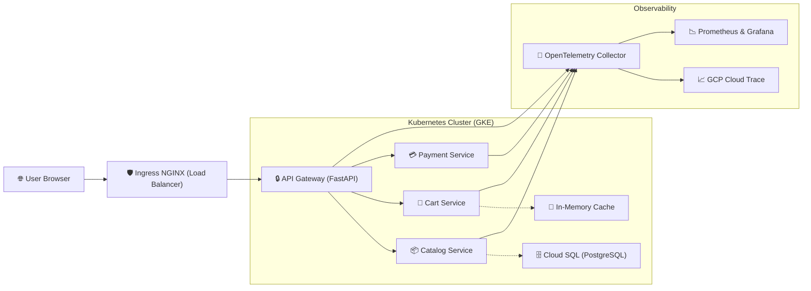

# 📘 GCP E-Commerce System Handbook

This handbook provides an "inch-by-inch" breakdown of the **End-to-End GCP E-Commerce Platform**. It covers how the code is structured, how the system communicates, and how to manage the lifecycle of the deployment.

---

## 🏗️ 1. High-Level Architecture

The platform is built as a **Microservices-driven Storefront** deployed on **GKE (Google Kubernetes Engine)** using a **GitOps (ArgoCD)** delivery model.

### 🔄 The Request Journey (End-to-End Flow)


---

## 📂 2. "What is What" (Project Structure)

| Directory | Purpose | Key Files |
| :--- | :--- | :--- |
| **`terraform/`** | Infrastructure-as-Code (IaC) | `main.tf`: Orchestrates VPN, GKE, and Cloud SQL. |
| **`services/`** | Core Application Logic | Subfolders for `frontend`, `catalog`, `cart`, `payment`, and `api-gateway`. |
| **`argocd/`** | GitOps Configuration | `apps.yaml`: Tells ArgoCD where to find the service manifests. |
| **`monitoring/`** | Observability Setup | `prometheus/values.yaml`: Configures metrics and alerts. |
| **`scripts/`** | Automation & Tooling | `build.sh`: The "One-Click" deployment script. `nuke.sh`: Cleanup. |

---

## 🚀 3. Deployment Lifecycle (`build.sh` Phases)

When you run `./scripts/build.sh`, the system follows an **8-Phase Orchestration**:

1.  **🛫 Pre-Flight**: Checks for `gcloud`, `kubectl`, `terraform`, and `helm` installations.
2.  **🔧 GCP APIs**: Enables all necessary Google Cloud services (Container, SQL, Build, etc.).
3.  **🏗️ Terraform**: Provisions the VPC, GKE Standard cluster, and Cloud SQL database.
4.  **⚓ Helm Controllers**: Installs `cert-manager`, `external-secrets`, `ingress-nginx`, and the **Prometheus Stack**.
5.  **🚀 ArgoCD**: Bootstraps the GitOps controller and registers the application manifests.
6.  **🐳 Parallel Build**: Submits all 5 microservices to **Google Cloud Build** simultaneously.
7.  **📤 Git Sync**: Commits and pushes the latest image tags to GitHub to trigger an ArgoCD auto-sync.
8.  **🔍 Verification**: Waits for all pods in the `ecommerce` namespace to reach "Running" status.

---

## ⌨️ 4. Command Cheatsheet

### 🛠️ Infrastructure Operations
*   **Deploy Everything**: `bash scripts/build.sh`
*   **Delete Everything (Nuke)**: `bash scripts/nuke.sh`
*   **Connect to GKE**: `gcloud container clusters get-credentials ecommerce-cluster --zone us-central1-a`

### 🔍 Inspecting Health
*   **View All Pods**: `kubectl get pods -A`
*   **Check App Status**: `kubectl get pods -n ecommerce`
*   **Check Ingress IP**: `kubectl get svc -n ingress-nginx`

### 💻 Local Access (Port-Forwarding)
| Service | Local URL | Command |
| :--- | :--- | :--- |
| **Store Frontend** | [https://localhost](https://localhost) | `kubectl port-forward svc/ingress-nginx-controller -n ingress-nginx 80:80 443:443` |
| **Grafana** | [http://localhost:3000](http://localhost:3000) | `kubectl port-forward svc/kube-prometheus-stack-grafana -n monitoring 3000:80` |
| **ArgoCD UI** | [https://localhost:8080](https://localhost:8080) | `kubectl port-forward svc/argocd-server -n argocd 8080:443` |

---

## 🔍 5. Troubleshooting & Interview Points

> [!TIP]
> **Interview "Inch-by-Inch" Talking Points:**
> 1.  **GKE Standard**: We chose Standard over Autopilot for full control over node pools and PodSecurity standards.
> 2.  **Stateless Design**: Services are stateless, with data persistence outsourced to Cloud SQL and in-memory caches.
> 3.  **Security**: We use **Workload Identity** allowing pods to access GCP Services without needing static `.json` keys.
> 4.  **Resilience**: The `ingress-nginx` layer handles TLS termination and traffic routing, acting as the cluster's "front door."

### How to Check Logs?
If a service is failing, run:
```bash
kubectl logs -f -l app=catalog-service -n ecommerce
```

### How to Check Metrics?
Open the **Grafana** dashboard (User: `admin`, Pass: `admin`) to see CPU/Memory trends for every microservice.

---

## 🛠️ 6. Build Script: Command-by-Command Deep Dive

This section provides a technical post-mortem of every command executed by `scripts/build.sh`. This level of detail is ideal for explaining the "how" and "why" during technical interviews.

### Phase 1: Enable GCP APIs
*   **Command**: `gcloud services enable container.googleapis.com sqladmin.googleapis.com ...`
*   **What it does**: Activates the specific resource managers within your GCP project.
*   **Deep Dive**: By default, a new GCP project has most APIs disabled to prevent accidental costs. This command ensures the GKE (`container`), Cloud SQL (`sqladmin`), and Cloud Build engines are ready to receive instructions.

### Phase 2: Terraform (Infrastructure)
*   **Command**: `gcloud storage buckets create "gs://${BUCKET_NAME}"`
*   **What it does**: Creates a Cloud Storage bucket to host the "Remote State" for Terraform.
*   **Deep Dive**: Storing the state (`.tfstate`) in GCS instead of your local machine allows for team collaboration and prevents state corruption if your local machine crashes.
*   **Command**: `terraform init -reconfigure`
*   **What it does**: Downloads providers (Google) and initializes the GCS backend.
*   **Command**: `terraform apply tfplan`
*   **What it does**: Atomically provisions the VPC, GKE cluster, and Cloud SQL instance based on the pre-calculated `tfplan`.

### Phase 3: Connect kubectl
*   **Command**: `gcloud container clusters get-credentials "$CLUSTER_NAME" --zone "$ZONE"`
*   **What it does**: Merges the cluster's endpoint and auth data into your local `.kube/config`.
*   **Deep Dive**: This "context switch" is what allows your local `kubectl` binary to talk to the specific master node of your new GKE cluster.

### Phase 4: Helm (Platform Controllers)
*   **Command**: `helm upgrade --install [NAME] [CHART] --wait --timeout 15m`
*   **What it does**: Idempotently installs or updates a Helm chart.
*   **Key Flag: `--wait`**: Extremely important. It forces Helm to wait until all Pods, PVCs, and Services are `Ready` before reporting success.
*   **Key Flag: `--timeout 15m`**: Given that GKE Standard may need to spin up new VM nodes to accommodate heavy charts like Prometheus, we provide a generous 15-minute window to prevent premature failure.

### Phase 5: ArgoCD (GitOps)
*   **Command**: `kubectl apply -f https://.../install.yaml --server-side --force-conflicts`
*   **What it does**: Installs the ArgoCD controller into the cluster.
*   **Key Flag: `--server-side`**: Uses the Kubernetes API server to handle the apply logic (SSA), which is more robust for large manifests.
*   **Command**: `kubectl apply -f argocd/apps.yaml`
*   **What it does**: Registers the "Application of Applications" pattern. ArgoCD now "watches" your GitHub repo for changes.

### Phase 6: Docker Builds (Cloud Build)
*   **Command**: `gcloud builds submit --tag "[IMAGE]" --async`
*   **What it does**: Packages your service code into a Docker image and pushes it to **Google Container Registry (GCR)**.
*   **Key Flag: `--async`**: This allows the script to submit all 5 builds to Google's servers **in parallel**, drastically reducing build time from 20 minutes to ~5 minutes.
*   **Command**: `gcloud builds log --stream [BUILD_ID]`
*   **What it does**: Connects to the remote build server to show you the compilation/test logs in real-time.

### Phase 7: Git Sync
*   **Command**: `git commit -m "deploy: full rebuild..." && git push origin "$GIT_BRANCH"`
*   **What it does**: Finalizes the local changes and sends them to GitHub.
*   **Deep Dive**: In a GitOps flow, the **Git Push is the actual deployment command**. Once GitHub receives the push, ArgoCD detects the new state and pulls the changes into GKE.

### Phase 8: Verify
*   **Command**: `kubectl get application ecommerce-catalog -n argocd -o jsonpath='{.status.health.status}'`
*   **What it does**: Queries the ArgoCD CRD (Custom Resource Definition) to see if the overall application health is "Healthy".
*   **Command**: `kubectl get pods -n ecommerce`
*   **What it does**: The final sanity check to ensure the Pods for `catalog`, `cart`, `payment`, `frontend`, and `api-gateway` are actually up and serving traffic.
